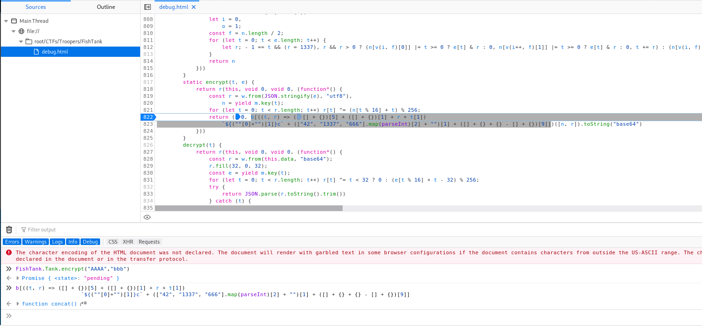

## FishTank Troopers20 Technical Challenge 

#### Task

We are presented with a website which uses `localStorage` to store encrypted data. These so called `Tank`s are used locally to store encrypted credentials, as claimed by the webpage. We are given one Tank with password and a target Tank which contains the flag that we need to decrypt.

```python3
LglVOnp3GQgiYWtLaDZgAtQdltvGThVfpM3Cvh6RAlFVKDFRHxs9NQgzGiMGYwh9X31HJP2sRnEaG+sJ8DsbU25JFi7q8FoNNw==
Th1sIs4V3ry$3cur3P4ssw0rd
```

```python3
aF8ccGR1QmIDSRJFEwUWLypj43LLGY2sdSPKHo/FGtsTQngfCR1qUyl/MX0yP2Z7Pzlgoz7DCzFZLXssD2R4D8+tE76ltzTnZxQMQ31mFBvIyhjS6cM3rQzIINgBAGYc2/Az3fjQ4sgi5DHYLyVSLuTeFoXau6reAtcgxCA2MfaLolHgq7TDggWATegXF6vt75Ll15G8yO0qu9Cu4uutgduspqebrL+c26PE5/XIkveggMFokUKxoNKh6K3K5OKcbE6GaVR0ikzG2fa60fXrtltmqWBKUJJ44Xvnc46os9hYFpRZUUpmEfJDhFa+sbiQfGiZKUl9Lg2HTMENws/ZSwYE3hUBCWALpGWwELm+RVl1fSNOdUhF
```

### Identifying the vulnerability


After spending some time observing and understanding how the application works, I focused on `encrypt` function, which was part of the minified javascript `fishtank.js`. To inspect this function more properly, I deminified the `.js` file and embedded it in my `debug.html` file, because with the minified version, the javascript debugger in firefox browser I used did not appear to function properly when using breakpoints etc. Here is the function listing:

```javascript
static encrypt(t, e) {
            return r(this, void 0, void 0, (function*() {
                const r = w.from(JSON.stringify(e), "utf8"),    
                    n = yield m.key(t);
                for (let t = 0; t < r.length; t++) r[t] ^= (n[t % 16] + t) % 256;
                return (0, b[((t, r) => ([] + {})[5] + ([] + {})[1] + r + t[1])
                    `${(""[0]+"")[1]}c` + (["42", "1337", "666"].map(parseInt)[2] + "")[1] + ([] + {} + {} - [] + {})[9]])([n, r]).toString("base64")
            }))
        }
```
The call to `r` is not important for us, it's just a function that assures that the function works asynchronically.
The important part of the `encrypt` function first uses `key` function to generate key from accepted password. This key is 32 bytes long, but as we shall see further, only first 16 bytes are used. Next, the provided plaintext is xored(after adding the position of processed plaintext) with the first 16 bytes of generated key. The return part is very well obfuscated, but with the help of debugger, we can see what's being returned by the function:



### Solving the problem

Thus, the returned data is base64 encoded ciphertext. But wait! right before the ciphertext is `concat`'d the key which was used to create it. This means we can easily recreate the original data from the base64 encoded string we got in the beginning.

All we need to do, is to base64 decode it, then take the first 16 bytes as a key and xor the rest([32:]) according to the `encrypt` with it.

I wrote a simple python script to do this:

```python3

import base64

def decrypt(ciphertext, key):
    plaintext = b''
    for i,c in enumerate(ciphertext):
        d = c ^ ((key[i%16] + i) % 256)
        plaintext += bytes([d])
    return plaintext

data = b''
with open('bstring_alt', 'rb') as f:
    data = f.read(4096)

data = base64.b64decode(data)

ciphertext = data[32:]
key = data[:16]


plaintext = decrypt(ciphertext, key)

print(key)
print(plaintext)

```

When we do this, we obtain the plaintext of the second `Tank` as follows:
```
{"flag":"-----BEGIN FISHBOWL FLAG-----\\nLf03BTPEPZVqqiO47JlXNB2rsPmnPjjaivmHpw6P\\nxFbq2gYuLdOTExCb/3cnkKn21Xhe/s7Bk4IVp4Qy\\nmi9/3L8TsVwuPqX7jZ6IXpokiHiYICDMeFVRdN8z\\nbEm+JJnG/hCvgCRzjaZy+sAjg6p6Jjypn89QXFac\\nDXwjq764\\n-----END FISHBOWL FLAG-----"}
```