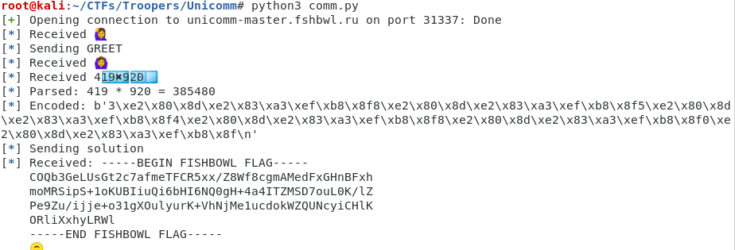

## UniComm Troopers20 Technical Challenge 

#### Task

In this task, we are given a service, that communicates in unicode (utf-8) emojis. There is some kind of protocol that we need to understand to complete the challenge.

### Solution

After connecting to the service, we receive a greeting smiley. When we reflect the greeting back we get a OK smiley and a simple computation problem. However, the problem uses keycap numbers instead of ascii, so we need to parse it first, then compute the solution, convert it back to the keycap representation and send it back to the service. If we do this correctly we receive the flag as a response.

### Solver

I wrote a python script where I used the `pwntools` framework to help me ease the communication with the server.

```python3
from pwn import *
END = b'\n'
GREET = b'\xf0\x9f\x99\x8b'
OK = b'\xf0\x9f\x99\x86'
KEYCAP = b'\xe2\x80\x8d\xe2\x83\xa3\xef\xb8\x8f'
PLUS = b'\xe2\x9e\x95'
MINUS = b'\xe2\x9e\x96' 
DOT = b'\xe2\x9c\x96'

def get_problem(connection):
    r = c.recv()
    log.info('Received ' + r.decode('utf-8'))
    log.info('Sending GREET')
    c.send(GREET + END)
    r = c.recvuntil('\n')
    log.info('Received ' + r.decode('utf-8'))
    r = c.recv()
    log.info('Received ' + r.decode('utf-8'))
    return r 

def encode_digit(digit):
    return bytes([0x30 + digit]) + KEYCAP

def encode_number(num):
    res = b''
    minus = False
    if num < 0:
        num = -num
        minus = True
    while num > 0:
        mod = num % 10
        res = encode_digit(mod) + res
        num = num//10
    if minus:
        res = MINUS + res
    return res

def parse_next_digit(digit_repr):
    if len(digit_repr) != 10 or digit_repr[1:10] != KEYCAP:
        return -1
    
    if digit_repr[0] > 0x39 or digit_repr[0] < 0x30:
        return -1

    result = digit_repr[0] - 0x30
    if result > 10:
        return -1

    return result

def parse_next_sign(sign_repr):
    if len(sign_repr) != 3:
        return -1
    
    if sign_repr == PLUS:
        return '+'

    if sign_repr == MINUS:
        return '-'

    if sign_repr == DOT:
        return '*'

    return -1

def parse_problem(problem):
    i = 0
    op1 = 0
    sign_fin = ''
    num = 0
    while problem[i] != 10:
        sign = parse_next_sign(problem[i:i+3])
        if sign != -1:
            sign_fin = sign
            op1 = num
            num = 0
            i += 3
        dig = parse_next_digit(problem[i:i+10])
        if dig > -1:
            num = num*10 + dig
            i += 10
            continue
        if sign == -1:
            log.error(f'not sign, not digit, cannot parse at {i}')
            return

    op2 = num
    return str(op1) + ' ' + sign_fin + ' ' + str(op2)

        
c = remote('unicomm-master.fshbwl.ru', 31337)
raw_problem = get_problem(c)
problem = parse_problem(raw_problem)
solution = eval(problem) # careful
log.info(f'Parsed: {problem} = {solution}')
encoded = encode_number(solution)
log.info(f'Encoded: {encoded + END}')
log.info('Sending solution')
c.send(encoded + END)
r = c.recv()
log.info(f'Received: {r.decode("utf-8")}')

with open('token.txt', 'wb') as f:
    f.write(r)
    f.close()

```

And an example of a succesfull run.



However, I got a little confused that the flag received changes for every run.