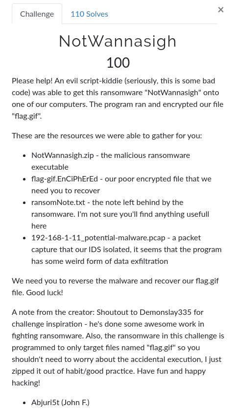
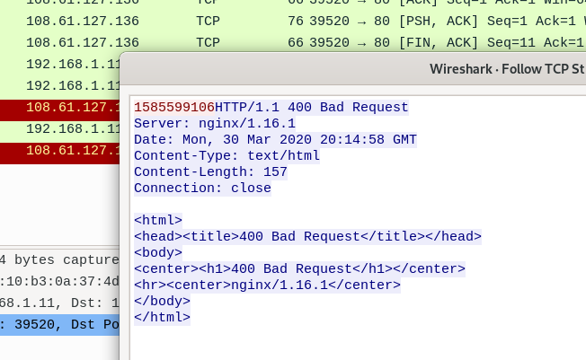

## NotWannasigh write-up

__ctf__: WPICTF2020

__category__: rev

__points__: 100

---

### Task

I started with reversing the binary. Here's an overview of what it does:

- uses time(0) as seed to `srand`
- opens socket and sends the used seed to ip address 108.61.127.136
- checks the size of file `flag.gif` and uses `rand` to generate key
- uses generated key to `xor` it the content of `flag.gif`
- deletes `flag.gif` and stores the xored (encrypted) content to `flag-gif.EnCiPhErEd`
- displays ransom note

Since there was a `pcap` where we found the following:

We knew the seed that was used to generate the encryption key.

### Solution

Since the encryption was pure xor, which is reversible, I decided to go for a dirty solution:
I patched the seed. So now instead of obtaining it with `time(0)`, `srand` was called with the captured seed. Then I nopped the section to surpass the seed sending part. Finally, I renamed the given `flag-gif.EnCiPhErEd` to `flag.gif` and run the binary. This way it was xored with the same key that the original binary and the program produced our original gif in `flag-gif.EnCiPhErEd`.

