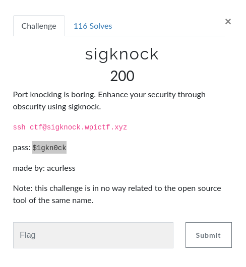

## Sigknock write-up
__ctf__: WPICTF2020

__category__: linux

__points__: 200

---
### Task



### Solution
With a strong hint in the description, it was clear that we will have to send some signals in some order.
Initially, it is not clear where do we need to send them.
Running `ps` on the server revealed very promising target, `/usr/bin/irqknock`.
After sending signals 2 and 3 to it, signal 4 killed it.
So first I figured out which of the signals up to 20 do actually kill the process.
Then I sent the non-killing signals in ascending order and it worked:

```
ssh ctf@sigknock.wpictf.xyz
~ $ ps
PID   USER     TIME  COMMAND
    1 wpictf    0:00 {init_d} /bin/sh /bin/init_d
    7 wpictf    0:00 /usr/bin/irqknock
    8 wpictf    0:00 /bin/sh
    9 wpictf    0:00 ps
~ $ kill -2 7
Got signal 2
State advanced to 1
~ $ kill -3 7
~ $ Got signal 3
State advanced to 2
kill -11 7
Got signal 11
State advanced to 3
~ $ kill -13 7
Got signal 13
State advanced to 4
~ $ kill -17 7
Got signal 17
State advanced to 5
WPI{1RQM@St3R}
```